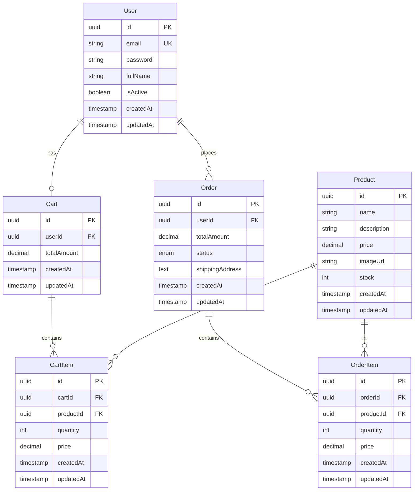

# 🛒 Wibesoft E-Commerce API

<p align="center">
  <a href="http://nestjs.com/" target="blank"></a>
</p>

<p align="center">Modern, ölçeklenebilir ve güvenli bir E-Ticaret Backend API'si</p>

## 📋 İçindekiler

- [Proje Hakkında](#-proje-hakkında)
- [Temel Özellikler](#-temel-özellikler)
- [Teknoloji Stack](#-teknoloji-stack)
- [Proje Yapısı](#-proje-yapısı)
- [Kurulum](#-kurulum)
- [Kullanım](#-kullanım)
- [API Endpoints](#-api-endpoints)
- [Docker ile Kullanım](#-docker-ile-kullanım)
- [Veritabanı](#-veritabanı)
- [Güvenlik](#-güvenlik)
- [Mimari ve Tasarım](#️-mimari-ve-tasarım)

## 🎯 Proje Hakkında

Wibesoft E-Commerce API, modern bir e-ticaret platformunun backend ihtiyaçlarını karşılamak üzere geliştirilmiş, production-ready bir REST API'dir. NestJS framework'ü kullanılarak TypeScript ile yazılmış olup, enterprise-level uygulamalar için gerekli tüm özellikleri barındırır.

### Geliştirici
- **Repository:** [Semavi7/wibesoft-ecommerce](https://github.com/Semavi7/wibesoft-ecommerce)
- **Branch:** development
- **Version:** 1.0.0

## ✨ Temel Özellikler

### 🔐 Kimlik Doğrulama ve Yetkilendirme
- **JWT Token tabanlı kimlik doğrulama**
- **HttpOnly Cookie desteği** ile güvenli token yönetimi
- **Passport.js stratejileri** (Local & JWT)
- **Global JWT Guard** ile otomatik endpoint koruması
- **Public decorator** ile açık endpoint yönetimi
- Bcrypt ile güvenli şifre hashleme

### 🛍️ E-Ticaret İşlevselliği
- **Ürün Yönetimi**: CRUD operasyonları ile tam ürün kontrolü
- **Kullanıcı Yönetimi**: Kayıt, profil güncelleme ve yönetim
- **Sepet Sistemi**: Kullanıcıya özel sepet işlemleri
  - Ürün ekleme/çıkarma
  - Miktar güncelleme (PATCH endpoint ile)
  - Stok kontrollü ekleme ve güncelleme
  - Gerçek zamanlı toplam hesaplama
- **Sipariş Yönetimi**: Checkout ve sipariş takibi
  - Sipariş oluşturma (sepetten)
  - Sipariş durumu yönetimi (PENDING, SHIPPED, DELIVERED, CANCELLED)
  - Sipariş geçmişi görüntüleme
  - Teslimat adresi yönetimi

### 📊 Teknik Özellikler
- **TypeORM** ile güçlü veritabanı yönetimi
- **PostgreSQL** veritabanı desteği
- **Swagger/OpenAPI** otomatik API dokümantasyonu
- **DTO Validation** ile veri doğrulama (class-validator)
- **DTO Transformation** ile güvenli veri aktarımı
- **Global Exception Filter** ile merkezi hata yönetimi
- **Logging Interceptor** ile istek/yanıt loglama
- **CORS** desteği
- **Docker & Docker Compose** ile kolay deployment

## 🚀 Teknoloji Stack

### Core Framework
- **NestJS 11.x** - Progressive Node.js framework
- **TypeScript 5.7** - Type-safe development
- **Node.js 20** - Runtime environment

### Veritabanı & ORM
- **PostgreSQL 15** - İlişkisel veritabanı
- **TypeORM 0.3** - ORM ve database migrations

### Kimlik Doğrulama
- **Passport.js** - Authentication middleware
- **JWT** - JSON Web Tokens
- **Bcrypt** - Password hashing

### Validasyon & Transformasyon
- **class-validator** - DTO validation
- **class-transformer** - Object transformation

### Dokümantasyon
- **Swagger/OpenAPI** - API documentation
- **@nestjs/swagger** - NestJS Swagger integration

### DevOps
- **Docker** - Containerization
- **Docker Compose** - Multi-container orchestration

### Development Tools
- **ESLint** - Code linting
- **Prettier** - Code formatting
- **Jest** - Testing framework
- **SWC** - Fast TypeScript compilation

## 📁 Proje Yapısı

```
wibesoft-ecommerce/
├── src/
│   ├── common/                          # Paylaşılan kod
│   │   ├── base.entity.ts              # Base entity (id, timestamps)
│   │   ├── filters/
│   │   │   └── http-exception.filter.ts # Global exception handling
│   │   └── interceptors/
│   │       └── logging.interceptor.ts   # Request/Response logging
│   │
│   ├── modules/
│   │   ├── auth/                        # Kimlik doğrulama modülü
│   │   │   ├── decorators/
│   │   │   │   ├── current-user.decorator.ts  # Aktif kullanıcı decorator
│   │   │   │   └── public.decorator.ts        # Public endpoint decorator
│   │   │   ├── dto/
│   │   │   │   └── login.dto.ts
│   │   │   ├── guards/
│   │   │   │   ├── jwt-auth.guard.ts          # JWT doğrulama
│   │   │   │   └── local-auth.guard.ts        # Login doğrulama
│   │   │   ├── strategies/
│   │   │   │   ├── jwt.strategy.ts
│   │   │   │   └── local.strategy.ts
│   │   │   ├── interfaces/
│   │   │   │   └── current-user.interface.ts
│   │   │   ├── auth.controller.ts
│   │   │   ├── auth.service.ts
│   │   │   └── auth.module.ts
│   │   │
│   │   ├── users/                       # Kullanıcı yönetimi
│   │   │   ├── dto/
│   │   │   │   ├── create-user.dto.ts
│   │   │   │   ├── update-user.dto.ts
│   │   │   │   └── user-response.dto.ts
│   │   │   ├── entities/
│   │   │   │   └── user.entity.ts
│   │   │   ├── users.controller.ts
│   │   │   ├── users.service.ts
│   │   │   ├── users.repository.ts
│   │   │   └── users.module.ts
│   │   │
│   │   ├── products/                    # Ürün yönetimi
│   │   │   ├── dto/
│   │   │   │   ├── create-product.dto.ts
│   │   │   │   ├── update-product.dto.ts
│   │   │   │   └── product-response.dto.ts
│   │   │   ├── entities/
│   │   │   │   └── product.entity.ts
│   │   │   ├── products.controller.ts
│   │   │   ├── products.service.ts
│   │   │   ├── products.repository.ts
│   │   │   └── products.module.ts
│   │   │
│   │   ├── cart/                        # Sepet işlemleri
│   │   │   ├── dto/
│   │   │   │   ├── add-to-cart.dto.ts
│   │   │   │   ├── update-cart-item.dto.ts
│   │   │   │   ├── cart-item-response.dto.ts
│   │   │   │   └── cart-response.dto.ts
│   │   │   ├── entities/
│   │   │   │   ├── cart.entity.ts
│   │   │   │   └── cart-item.entity.ts
│   │   │   ├── cart.controller.ts
│   │   │   ├── cart.service.ts
│   │   │   ├── cart.repository.ts
│   │   │   └── cart.module.ts
│   │   │
│   │   └── order/                       # Sipariş yönetimi
│   │       ├── dto/
│   │       │   ├── create-order.dto.ts
│   │       │   ├── order-item-response.dto.ts
│   │       │   └── order-response.dto.ts
│   │       ├── entities/
│   │       │   ├── order.entity.ts
│   │       │   └── order-item.entity.ts
│   │       ├── enums/
│   │       │   └── order-status.enum.ts
│   │       ├── order.controller.ts
│   │       ├── order.service.ts
│   │       ├── order.repository.ts
│   │       └── order.module.ts
│   │
│   ├── app.module.ts                    # Ana uygulama modülü
│   └── main.ts                          # Bootstrap dosyası
│
├── test/                                # E2E testler
│   ├── app.e2e-spec.ts
│   └── jest-e2e.json
│
├── docker-compose.yml                   # Docker compose config
├── Dockerfile                           # Multi-stage Docker build
├── .env                                 # Environment variables
├── package.json
├── tsconfig.json
├── nest-cli.json
└── README.md
```

## 🔧 Kurulum

### Gereksinimler
- **Node.js** >= 20.x
- **npm** >= 10.x
- **PostgreSQL** >= 15.x (veya Docker)

### 1. Repository'yi Klonlayın
```bash
git clone https://github.com/Semavi7/wibesoft-ecommerce.git
cd wibesoft-ecommerce
```

### 2. Bağımlılıkları Yükleyin
```bash
npm install
```

### 3. Environment Variables Ayarlayın
`.env` dosyasını oluşturun ve aşağıdaki değişkenleri yapılandırın:

```env
# Database Configuration
DB_HOST=localhost
DB_PORT=5432
DB_USERNAME=postgres
DB_PASSWORD=your_password_here
DB_NAME=ecommerce_db

# JWT Configuration
JWT_SECRET=your_secret_key_here
JWT_EXPIRES_IN=1d

# Application
NODE_ENV=development
PORT=3000
```

> ⚠️ **Güvenlik Notu**: Production ortamında `JWT_SECRET` ve `DB_PASSWORD` değerlerini mutlaka değiştirin!

### 4. Veritabanını Oluşturun
PostgreSQL'de veritabanını oluşturun:

```sql
CREATE DATABASE ecommerce_db;
```

## 🎮 Kullanım

### Development Mode
```bash
# Watch mode ile çalıştırma (otomatik yeniden başlatma)
npm run start:dev

# Normal development mode
npm run start

# Debug mode
npm run start:debug
```

Uygulama başlatıldıktan sonra:
- **API:** http://localhost:3000
- **Swagger Docs:** http://localhost:3000/api

### Production Mode
```bash
# Build
npm run build

# Production'da çalıştırma
npm run start:prod
```

### Code Quality
```bash
# Linting
npm run lint

# Formatting
npm run format
```

## 📡 API Endpoints

### 🔐 Authentication (`/auth`)
| Method | Endpoint | Açıklama | Auth |
|--------|----------|----------|------|
| POST | `/auth/register` | Yeni kullanıcı kaydı | ❌ |
| POST | `/auth/login` | Giriş yap (HttpOnly cookie) | ❌ |
| POST | `/auth/logout` | Çıkış yap (cookie sil) | ✅ |
| GET | `/auth/profile` | Profil bilgisi | ✅ |

**Login Response:**
```json
{
  "message": "Giriş başarılı",
  "user": {
    "id": "uuid",
    "email": "user@example.com",
    "fullName": "John Doe",
    "isActive": true
  }
}
```

### 👤 Users (`/users`)
| Method | Endpoint | Açıklama | Auth |
|--------|----------|----------|------|
| GET | `/users` | Tüm kullanıcıları listele | ✅ |
| GET | `/users/:id` | Kullanıcı detayı | ✅ |
| PATCH | `/users/:id` | Kullanıcı güncelle | ✅ |
| DELETE | `/users/:id` | Kullanıcı sil | ✅ |

### 🛍️ Products (`/products`)
| Method | Endpoint | Açıklama | Auth |
|--------|----------|----------|------|
| GET | `/products` | Tüm ürünleri listele | ❌ |
| GET | `/products/:id` | Ürün detayı | ❌ |
| POST | `/products` | Yeni ürün oluştur | ✅ |
| PATCH | `/products/:id` | Ürün güncelle | ✅ |
| DELETE | `/products/:id` | Ürün sil | ✅ |

**Product Schema:**
```json
{
  "name": "Ürün Adı",
  "description": "Ürün açıklaması",
  "price": 99.99,
  "imageUrl": "https://example.com/image.jpg",
  "stock": 100
}
```

### 🛒 Cart (`/cart`)
| Method | Endpoint | Açıklama | Auth |
|--------|----------|----------|------|
| GET | `/cart` | Aktif kullanıcının sepetini getir | ✅ |
| POST | `/cart` | Sepete ürün ekle | ✅ |
| PATCH | `/cart/:itemId` | Sepetteki ürün adedini güncelle | ✅ |
| DELETE | `/cart/:itemId` | Sepetten ürün çıkar | ✅ |

**Add to Cart Request:**
```json
{
  "productId": "uuid",
  "quantity": 2
}
```

**Update Cart Item Quantity Request:**
```json
{
  "quantity": 3
}
```

**Cart Response:**
```json
{
  "id": "uuid",
  "userId": "uuid",
  "items": [
    {
      "id": "uuid",
      "productId": "uuid",
      "productName": "Ürün Adı",
      "price": 99.99,
      "quantity": 2,
      "subtotal": 199.98
    }
  ],
  "totalAmount": 199.98,
  "createdAt": "2026-02-03T10:00:00.000Z",
  "updatedAt": "2026-02-03T10:30:00.000Z"
}
```

### 📦 Orders (`/orders`)
| Method | Endpoint | Açıklama | Auth |
|--------|----------|----------|------|
| POST | `/orders` | Sipariş oluştur (checkout) | ✅ |
| GET | `/orders` | Kullanıcının siparişleri | ✅ |
| GET | `/orders/:id` | Sipariş detayı | ✅ |

**Create Order Request:**
```json
{
  "shippingAddress": "Adres bilgisi"
}
```

**Order Response:**
```json
{
  "id": "uuid",
  "userId": "uuid",
  "items": [
    {
      "productId": "uuid",
      "productName": "Ürün Adı",
      "price": 99.99,
      "quantity": 2,
      "subtotal": 199.98
    }
  ],
  "totalAmount": 199.98,
  "status": "PENDING",
  "shippingAddress": "Adres bilgisi",
  "createdAt": "2026-02-03T10:00:00.000Z"
}
```

**Order Status Enum:**
- `PENDING` - Beklemede
- `SHIPPED` - Kargoya verildi
- `DELIVERED` - Teslim edildi
- `CANCELLED` - İptal edildi

## 🐳 Docker ile Kullanım

Proje, Docker ve Docker Compose ile production-ready olarak çalıştırılabilir.

### Servisler
- **db**: PostgreSQL 15 Alpine
- **app**: NestJS Application (Multi-stage build)

### Çalıştırma
```bash
# Servisleri başlat (detached mode)
docker-compose up -d

# Logları takip et
docker-compose logs -f

# Servisleri durdur
docker-compose down

# Volume'ler ile birlikte temizle
docker-compose down -v
```

### Docker Build Stratejisi
Dockerfile, **multi-stage build** kullanarak optimize edilmiştir:

1. **Base Stage**: Package files kopyalama
2. **Build Stage**: Tüm dependencies ile build
3. **Production Stage**: 
   - Sadece production dependencies
   - Non-root user (güvenlik)
   - Optimized runtime

**Özellikler:**
- Alpine Linux (minimal image size)
- Non-root user (security best practice)
- Production dependencies only
- Health check ready
- Environment variables support

## 🗄️ Veritabanı

### Entity İlişkileri



### Base Entity
Tüm entity'ler `BaseEntity` sınıfından türetilmiştir:
- `id`: UUID primary key
- `createdAt`: Oluşturulma zamanı
- `updatedAt`: Güncellenme zamanı

### TypeORM Configuration
- **Synchronize**: `true` (Development için - Production'da migration kullanın!)
- **Database Type**: PostgreSQL
- **Connection Pooling**: Default settings
- **Naming Strategy**: Default snake_case

## 🔒 Güvenlik

### Kimlik Doğrulama Akışı

1. **Kayıt (Register)**
   ```
   POST /auth/register
   → UserService.create()
   → Bcrypt password hash
   → Database save
   → Return UserResponseDto (password hariç)
   ```

2. **Giriş (Login)**
   ```
   POST /auth/login
   → LocalAuthGuard validates credentials
   → Local Strategy verify (bcrypt compare)
   → JWT token generation
   → Set HttpOnly Cookie
   → Return user data
   ```

3. **Korumalı Endpoint Erişimi**
   ```
   GET /cart
   → JwtAuthGuard (Global)
   → Check Cookie for JWT
   → JWT Strategy validate
   → Inject user via @CurrentUser()
   → Execute controller method
   ```

### Güvenlik Özellikleri

✅ **HttpOnly Cookies**: XSS saldırılarına karşı koruma
✅ **Bcrypt Hashing**: Güvenli şifre saklama (salt rounds: 10)
✅ **JWT Tokens**: Stateless authentication
✅ **Global Guards**: Tüm endpoint'ler varsayılan korumalı
✅ **DTO Validation**: Input sanitization
✅ **CORS Configuration**: Cross-origin güvenliği
✅ **Environment Variables**: Hassas bilgilerin korunması
✅ **Password Exclusion**: Response DTO'larda şifre gizleme

### Best Practices

- 🔐 `.env` dosyası git'e commitlenmez (.gitignore)
- 🔐 Production'da güçlü JWT_SECRET kullanın
- 🔐 HTTPS kullanımı önerilir
- 🔐 Rate limiting eklenebilir (future enhancement)
- 🔐 Helmet.js ile HTTP headers güvenliği (eklenebilir)

## 🏗️ Mimari ve Tasarım

### Mimari Kararlar

Proje geliştirilirken sürdürülebilirlik ve güncel best-practice'ler göz önünde bulundurularak bazı kritik mimari kararlar alınmıştır:

**1. Custom Repository Pattern (TypeORM 0.3+)**
Eski `extends Repository<Entity>` yöntemi yerine, **Composition** yaklaşımı tercih edilmiştir. 
- **Neden?** TypeORM 0.3.x sürümü ile birlikte `@EntityRepository` decorator'ı deprecated olmuştur.
- **Avantajı:** Bu yaklaşım, repository katmanını framework'ün iç yapısından (implementation details) soyutlar ve Unit Test yazarken repository'leri mock'lamayı çok daha kolay hale getirir.

**2. Domain-Driven Design (DDD) ve Modüler Yapı**
`Cart` & `CartItem` ve `Order` & `OrderItem` gibi birbirine sıkı sıkıya bağlı varlıklar, ayrı modüller yerine kendi ana modülleri (`CartModule`, `OrdersModule`) altında toplanmıştır.
- **Neden?** DDD prensiplerine göre `Cart` ve `Order` birer **Aggregate Root**'tur. Alt parçaları (`Item`'lar) tek başlarına var olamazlar.
- **Avantajı:** Bu yapı, veri bütünlüğünü (Consistency) korumayı sağlar ve transaction yönetimini merkezi hale getirir.

### Katmanlı Mimari

```
Controller Layer (API Endpoints)
        ↓
Service Layer (Business Logic)
        ↓
Repository Layer (Data Access)
        ↓
Database (PostgreSQL)
```

### Design Patterns

1. **Dependency Injection**: NestJS IoC Container
2. **Repository Pattern**: Data access abstraction
3. **DTO Pattern**: Data transfer & validation
4. **Decorator Pattern**: Metadata & custom decorators
5. **Guard Pattern**: Route protection
6. **Interceptor Pattern**: Request/Response manipulation
7. **Filter Pattern**: Exception handling
8. **Strategy Pattern**: Passport authentication strategies

### Modüler Yapı

Her modül kendi içinde bağımsız ve yeniden kullanılabilirdir:
- **Controllers**: HTTP isteklerini yönetir
- **Services**: İş mantığını içerir
- **Repositories**: Veritabanı işlemlerini soyutlar
- **DTOs**: Veri transferi ve validasyon
- **Entities**: Veritabanı şeması
- **Guards**: Yetkilendirme kontrolü
- **Decorators**: Metadata ve custom işlevsellik

### Global Providers

**APP_GUARD**: `JwtAuthGuard`
- Tüm endpoint'leri otomatik korur
- `@Public()` decorator ile bypass edilebilir

**APP_INTERCEPTOR**: `LoggingInterceptor`
- Tüm HTTP isteklerini loglar
- Response time ölçümü
- User-agent tracking

**APP_FILTER**: `AllExceptionsFilter`
- Global exception handling
- Structured error responses
- Error logging (warn/error levels)


## 🤝 Katkıda Bulunma

1. Fork the repository
2. Create a feature branch (`git checkout -b feature/amazing-feature`)
3. Commit your changes (`git commit -m 'Add amazing feature'`)
4. Push to the branch (`git push origin feature/amazing-feature`)
5. Open a Pull Request

## 📄 License

Bu proje UNLICENSED lisansı altındadır.

## 📞 İletişim

**Repository**: [https://github.com/Semavi7/wibesoft-ecommerce](https://github.com/Semavi7/wibesoft-ecommerce)

---

<p align="center">Built with ❤️ using NestJS</p>
